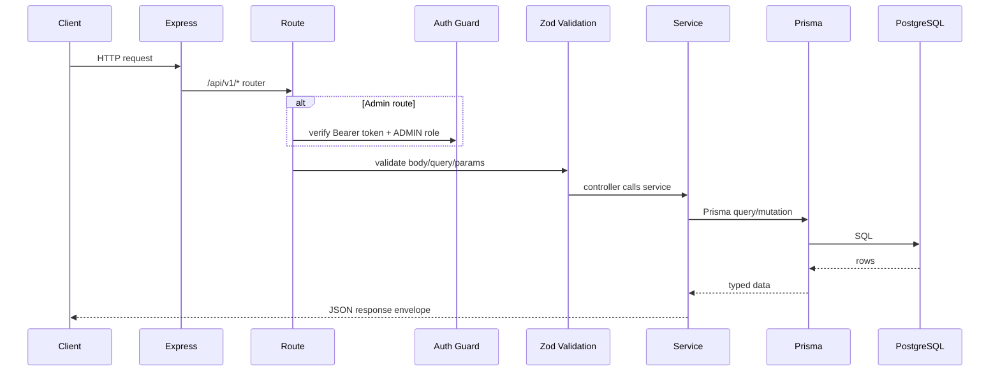

<div align="center">

# emtiaz-server

**REST API and content backend for Emtiaz Ahmed's portfolio.**

Express + TypeScript + Prisma + PostgreSQL backend powering projects, blog posts, achievements, contact messages, and the private admin CMS used by the frontend.

[](https://emtiaz-server.vercel.app)
[](https://github.com/Emtiaz-ahmed-13/emtiaz-client)
[](#license)


</div>

---

## Overview

`emtiaz-server` is the API layer for a full-stack portfolio. It stores every portfolio section in PostgreSQL and exposes clean REST endpoints for the frontend.

The API supports:

- Public portfolio aggregation
- Public project and blog detail pages
- Admin-only project CRUD
- Admin-only blog CRUD
- Contact form storage and email notification
- Admin authentication with JWT and bcrypt
- ImgBB share-link resolution for reliable cover images

## Highlights

- **Single portfolio endpoint:** `GET /api/v1/portfolio` returns profile, projects, skills, experience, education, achievements, and latest posts.
- **Blog module:** published posts for public pages, all posts for admin, create/update/delete behind auth.
- **Project module:** public project archive and detail pages, admin project management.
- **Admin-only auth:** login requires an `ADMIN` user; registration is not public.
- **Zod validation:** request body/query/params are validated before controllers run.
- **Central error handling:** consistent success/error envelopes across the API.
- **Image URL resolver:** converts ImgBB viewer links (`ibb.co/...`) into direct CDN assets (`i.ibb.co/...`).
- **Dev-friendly CORS:** any localhost port is allowed in development; Vercel previews are allowed by default.

## Architecture

```mermaid
flowchart TD
  Client[Next.js Client] --> API[Express API]
  Admin[Admin CMS] --> Auth[Auth Module]
  Admin --> API

  API --> Router[/api/v1 Router]
  Router --> Public[Public Modules]
  Router --> Private[Admin Modules]

  Private --> Guard[auth ADMIN]
  Private --> Validate[Zod validateRequest]
  Public --> Validate

  Validate --> Controller[Controller]
  Controller --> Service[Service Layer]
  Service --> Prisma[Prisma Client]
  Prisma --> DB[(PostgreSQL)]

  Service --> Image[ImgBB URL Resolver]
  Controller --> Response[sendResponse]
  API --> Error[globalErrorHandler]
```

## Request Lifecycle



## Tech Stack

| Area | Stack |
|---|---|
| Runtime | Node.js 20 |
| Framework | Express 4 |
| Language | TypeScript |
| ORM | Prisma 7 + `@prisma/adapter-pg` |
| Database | PostgreSQL |
| Validation | Zod |
| Auth | JWT + bcrypt |
| Email | Nodemailer |
| Dev DB | Docker Compose |
| Deployment | Vercel serverless |

## Project Structure

```txt
src/
├── app/
│   ├── modules/
│   │   ├── Auth/          # Admin login/register/me
│   │   ├── Blog/          # Blog CRUD + public posts
│   │   ├── Project/       # Project CRUD + public detail
│   │   ├── Portfolio/     # Public aggregate endpoint
│   │   ├── Contact/       # Contact form + admin inbox
│   │   ├── Profile/
│   │   ├── Skill/
│   │   ├── Experience/
│   │   ├── Education/
│   │   └── Achievement/
│   ├── middleware/
│   │   ├── auth.ts
│   │   ├── validateRequest.ts
│   │   └── globalErrorHandler.ts
│   ├── routes/
│   ├── shared/
│   └── errors/
├── config/
├── helpers/
│   ├── imageUrlHelpers.ts
│   ├── jwtHelpers.ts
│   ├── paginationHelpers.ts
│   ├── slugHelpers.ts
│   └── userHelpers.ts
├── app.ts
└── server.ts

prisma/
├── schema.prisma
└── seed.ts
```

## Data Model

| Model | Purpose |
|---|---|
| `User` | Admin authentication |
| `Profile` | Hero/about/contact profile data |
| `Project` | Project cards and case-study content |
| `BlogPost` | Blog archive and detail pages |
| `Skill` | Skill categories and levels |
| `Experience` | Work, club, and OSS timeline |
| `Education` | Education timeline |
| `Achievement` | Awards, certificates, hackathons |
| `ContactMessage` | Contact form submissions |

Full schema: [`prisma/schema.prisma`](./prisma/schema.prisma)

## API Reference

Base URL:

```txt
http://localhost:5001/api/v1
```

### Public endpoints

| Method | Path | Purpose |
|---|---|---|
| `GET` | `/portfolio` | Full public portfolio payload |
| `GET` | `/projects` | Published projects |
| `GET` | `/projects/slug/:slug` | Project detail |
| `GET` | `/blog` | Published blog posts |
| `GET` | `/blog/slug/:slug` | Blog post detail |
| `POST` | `/contact` | Submit contact message |

### Admin endpoints

Require:

```txt
Authorization: Bearer <accessToken>
```

| Method | Path | Purpose |
|---|---|---|
| `POST` | `/auth/login` | Admin login |
| `GET` | `/auth/me` | Current admin |
| `GET` | `/blog/admin/all` | All posts including drafts |
| `POST` | `/blog` | Create post |
| `PATCH` | `/blog/:id` | Update post |
| `DELETE` | `/blog/:id` | Delete post |
| `POST` | `/projects` | Create project |
| `PATCH` | `/projects/:id` | Update project |
| `DELETE` | `/projects/:id` | Delete project |

Response shape:

```json
{
  "success": true,
  "message": "Operation successful.",
  "data": {}
}
```

## Getting Started

```bash
git clone git@github.com:Emtiaz-ahmed-13/emtiaz-server.git
cd emtiaz-server
npm install
cp .env.sample .env
docker compose up -d
npx prisma db push
npm run db:seed
npm run dev
```

Smoke test:

```bash
curl http://localhost:5001/api/v1/portfolio
```

## Environment Variables

| Key | Required | Purpose |
|---|---|---|
| `NODE_ENV` | Yes | `development` or `production` |
| `PORT` | Yes | Local server port, usually `5001` |
| `DATABASE_URL` | Yes | PostgreSQL connection string |
| `JWT_SECRET` | Yes | Access token signing secret |
| `JWT_EXPIRES_IN` | Yes | Access token lifetime |
| `JWT_REFRESH_TOKEN_SECRET` | Yes | Refresh token signing secret |
| `JWT_REFRESH_TOKEN_EXPIRES_IN` | Yes | Refresh token lifetime |
| `ADMIN_EMAIL` | Yes | Seeded admin email |
| `ADMIN_PASSWORD` | Yes | Seeded admin password |
| `ADMIN_NAME` | Yes | Seeded admin display name |
| `SMTP_HOST` / `SMTP_PORT` / `SMTP_USER` / `SMTP_PASS` | Optional | Contact email delivery |
| `CORS_ORIGINS` | Optional | Extra allowed origins |

## Scripts

| Command | Purpose |
|---|---|
| `npm run dev` | Start local server with hot reload |
| `npm run build` | Generate Prisma client and compile TypeScript |
| `npm run test` | Run API behavior and middleware tests |
| `npm run test:watch` | Run tests in watch mode while developing |
| `npm run start` | Run compiled server |
| `npm run db:migrate` | Create/apply dev migration |
| `npm run db:seed` | Seed admin and portfolio data |
| `npm run db:reset` | Reset database and rerun migrations |

## Testing & Rate Limits

The API uses `express-rate-limit` in two layers:

- General API traffic: `300` requests per IP per `15` minutes on `/api/v1`.
- Contact form: `10` submissions per IP per `15` minutes.

Tests use `vitest` + `supertest`:

- `tests/app.test.ts` checks the root health response and structured 404 JSON.
- `tests/rateLimiter.test.ts` proves the limiter allows requests up to the configured limit, then returns `429`.

Run them with:

```bash
npm run test
```

## Deployment

The API is deployed to Vercel as a serverless Express app.

Production checklist:

1. Create a PostgreSQL database.
2. Set every required env var in Vercel.
3. Set `CORS_ORIGINS` to the frontend URL if using a custom domain.
4. Run Prisma schema setup against production DB.
5. Push `main`.

Live API:

```txt
https://emtiaz-server.vercel.app
```

## Related Repository

- Frontend: [Emtiaz-ahmed-13/emtiaz-client](https://github.com/Emtiaz-ahmed-13/emtiaz-client)

## License

MIT © [Emtiaz Ahmed](https://github.com/Emtiaz-ahmed-13)
